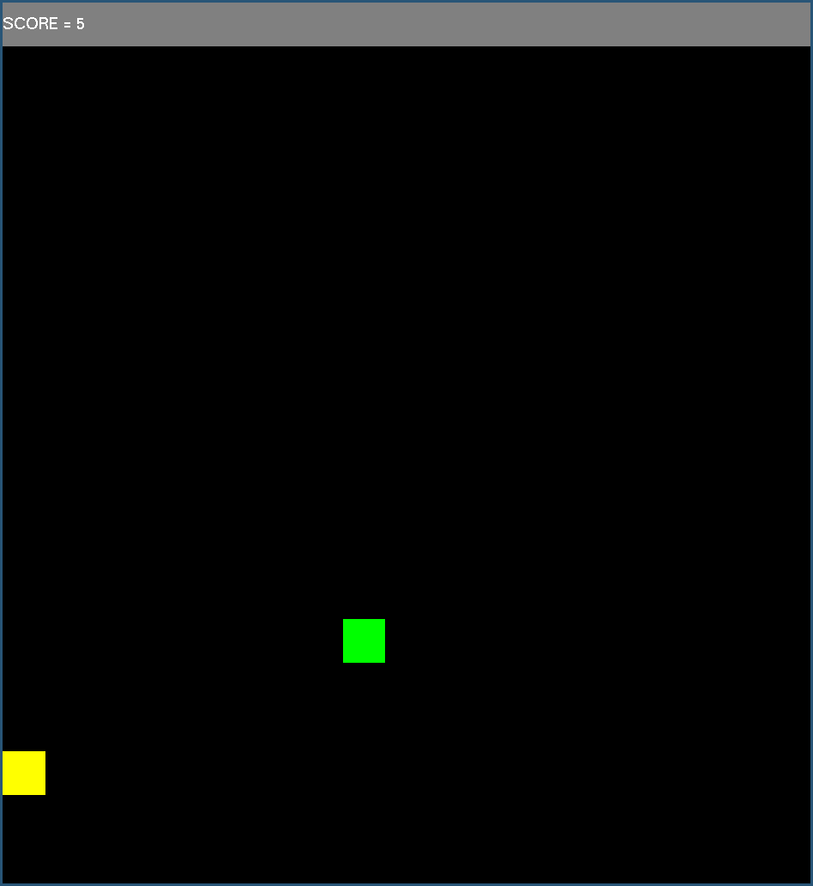

    

<h1 align="center"> GLSNAKE</h1>

    

## About

This is a game made with [OpenGl](https://www.opengl.org/) graphics library. This is made only for linux.

## Requirments

Install the following pakages/libraries.

* GLUT
* C++ Libraries
* C libraries
* Unistd library

## Compilation and Running

Download the repository and run the given command in the respective game folder.

`sh run.sh`

## Scores

Open the 'scores.txt' file to see your scores.

NOTE:
This file will be created when you run the game for the first time.
